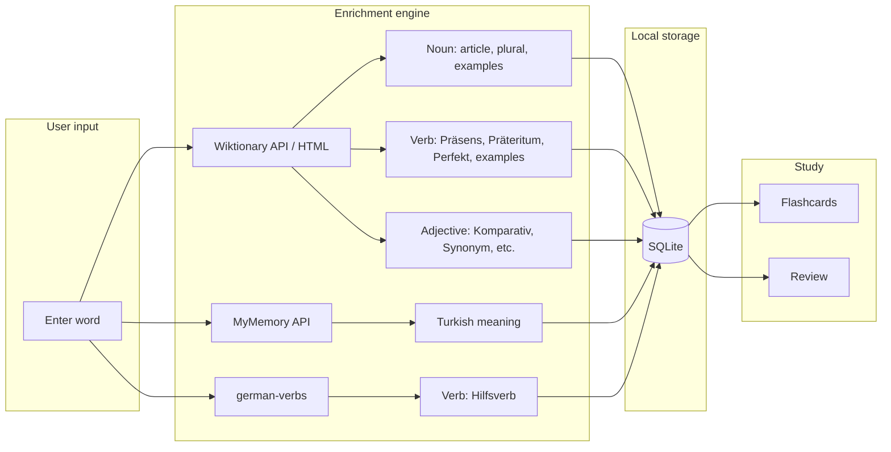

# Alle Deutschen Wörter

A German vocabulary app for **iOS**, **Android**, and **Web** (PWA). Add nouns, verbs, and adjectives; get automatic grammar and Turkish meanings; study with flashcards and a simple spaced-repetition review. Built with **React Native**, **Expo**, **TypeScript**, and **SQLite**. All data stays on your device.

---

## For users

**Alle Deutschen Wörter** helps you build a personal German vocabulary with correct grammar and Turkish meanings. You type a word, and the app fills in articles, plurals, verb forms, example sentences, and Turkish translation where possible. You can then review words as flashcards and use the built-in review system to schedule repetitions.

- **Nouns**: Article (der/die/das), plural, Turkish meaning, example sentences.
- **Verbs**: Conjugations (Präsens, Präteritum, Perfekt), Hilfsverb (haben/sein), regularity, Turkish meaning, example sentences.
- **Adjectives**: Komparativ, Superlativ, synonym, antonym, Turkish meaning, example sentences.

You can use the app on your phone (Expo Go or a native build), in the browser, or install it on your iPhone as a PWA from Safari (“Add to Home Screen”).

---

## For developers

The app is an **Expo (React Native)** project with **expo-router**, **expo-sqlite**, and a small **enrichment pipeline** that pulls data from:

- **Wiktionary** (de.wiktionary.org): via MediaWiki API (wikitext templates) for noun/verb grammar and HTML for example sentences and adjective/synonym/antonym data.
- **MyMemory API**: German → Turkish translation for the “Bedeutung” (meaning) field.
- **german-verbs**: Hilfsverb (haben/sein) and verbs that take both.

Enrichment runs on the client when you enter a word; results are stored locally in SQLite. No backend is required. The codebase is structured around `app/` (screens), `components/`, `lib/` (database, enrichment, word utils), and `types/word.ts`.

---

## Features

### Word types and forms

| Type        | Auto-filled from enrichment                                                                 | Manual / optional                    |
|------------|----------------------------------------------------------------------------------------------|--------------------------------------|
| **Nouns**  | Article (der/die/das), plural, Turkish meaning, example sentences (from Wiktionary + MyMemory) | Meaning edit, example sentences      |
| **Verbs**  | Präsens, Präteritum, Perfekt, Hilfsverb (haben/sein), regularity, Turkish meaning, examples | Meaning edit, example sentences      |
| **Adjectives** | Komparativ, Superlativ, synonym, antonym, Turkish meaning, example sentences             | Meaning edit, example sentences      |
| **Other**  | Turkish meaning, example sentences                                                          | —                                    |

- **Nouns**: Article and plural from Wiktionary’s “Deutsch Substantiv Übersicht” template; examples from the Beispiele section; Turkish meaning from MyMemory.
- **Verbs**: Präsens, Präteritum, Perfekt (Partizip II), and regularity from Wiktionary’s “Deutsch Verb Übersicht” template; **Hilfsverb** from the **german-verbs** dataset (including verbs that take both haben and sein); examples from Wiktionary; Turkish meaning from MyMemory.
- **Adjectives**: Komparativ, Superlativ, first synonym/antonym, and example sentences from Wiktionary HTML; Turkish meaning from MyMemory.

### Color-coded UI

- **Nouns**: Article colors — *der* (blue), *die* (red), *das* (green), plural *die* (orange).
- **Verbs**: Green tint for regelmäßig, red tint for unregelmäßig; Hilfsverb shown next to Perfekt (e.g. *gegangen (sein)*).

### Flashcards and review

- **Flashcards**: Every saved word becomes a card; front = word, back = meaning, grammar, and example sentences.
- **Review**: Simple spaced repetition with intervals — Again (1d), Hard (3d), Good (7d), Easy (14d). Review queue is driven by `nextReviewAt` and local SQLite.

### Cross-device support

- **Native**: iOS and Android via Expo (Expo Go or dev/build clients).
- **Web**: Runs in the browser with `npx expo start --web`.
- **PWA**: Static export can be deployed and installed on iPhone (Safari “Add to Home Screen”) or Android with a standalone display and theme color.

### Other

- **Word list**: Filter by type (noun/verb/adjective/other), search by word or meaning.
- **Navigation**: Home, Words, Flashcards, Review, Settings.
- **Database**: SQLite (words, sentences, reviews) with relations; all data is local.

---

## Architecture (high level)



**Flow in words:** User enters a word → enrichment engine fetches data from Wiktionary, MyMemory, and (for verbs) the german-verbs dataset → results are merged and saved in SQLite → the same data backs the word list, flashcards, and the review system.

---

## Installation and setup

### Prerequisites

- **Node.js** (LTS recommended)
- **npm** (or yarn/pnpm)
- For native runs: **Expo Go** on a device, or **iOS Simulator** / **Android Emulator**

### Install dependencies

```bash
git clone <repository-url>
cd german-learning-app
npm install
```

### Development

**Native (iOS/Android):**

```bash
npx expo start
```

Then scan the QR code with Expo Go, or press `i` / `a` for iOS/Android simulator.

**Web:**

```bash
npx expo start --web
```

Opens the app in the browser. Use the Expo CLI from the project (e.g. `npx expo start`); avoid a global `expo-cli`.

---

## iPhone usage (PWA)

1. **Deploy the web build** (see [Production build](#production-build)) to a host (e.g. Netlify, Vercel, or any static server).
2. On your **iPhone**, open the app URL in **Safari**.
3. Tap **Share** → **“Add to Home Screen”**.
4. Name the shortcut if you like and confirm. The app opens in standalone mode (no browser UI), with theme color and icon from the PWA manifest.

PWA settings (name, icons, `theme_color`, `background_color`, `display: standalone`) are in **`app.json`** under `expo.web` and in **`public/manifest.json`**.

---

## Production build

### Web (static PWA)

```bash
npm run export:web
```

This copies the app icon into `public/` and runs `npx expo export -p web`. Output is in **`dist/`**.

- **Local test:**  
  `npx serve dist --single`
- **Deploy:** Upload the contents of `dist/` to any static host (Netlify, Vercel, GitHub Pages, etc.).

### Native (iOS/Android)

Use **EAS Build** or a classic Expo prebuild + Xcode/Android Studio workflow. See the [Expo documentation](https://docs.expo.dev/build/introduction/) for credentials and app-store builds.

---

## Project structure

| Path | Purpose |
|------|--------|
| **`app/`** | Screens (expo-router): tabs (Home, Words, Flashcards, Review, Settings), add-word flow (add-noun, add-verb, add-adjective, add-other) |
| **`components/`** | NounCard, VerbCard, AdjectiveCard, OtherCard, WordCard, FormInput |
| **`lib/database.ts`** | SQLite schema, CRUD for words, sentences, reviews |
| **`lib/enrichWord.ts`** | Enrichment: Wiktionary (API + HTML), MyMemory (Turkish), noun/verb/adjective/other |
| **`lib/verbAuxiliary.ts`** | Hilfsverb from german-verbs (+ list of “haben/sein” verbs) |
| **`lib/wordUtils.ts`** | Row → Word mapping, article colors, auxiliary serialization |
| **`types/word.ts`** | Word types (Noun, Verb, Adjective, Other), AuxiliaryFlags, Sentence, Review |
| **`context/DatabaseContext.tsx`** | DB init and ready state for the app |

Data is stored only in local SQLite; no server or account is required.

---

## Optional improvements

- **Offline caching (PWA):** Add a service worker (e.g. [Workbox](https://developer.chrome.com/docs/workbox/)) after `expo export -p web` to cache assets and enable basic offline use. See [Expo’s PWA guide](https://docs.expo.dev/guides/progressive-web-apps/). Use a versioned cache strategy so updates are visible.
- **Spaced repetition:** The current review uses fixed intervals (1d, 3d, 7d, 14d). You could plug in an SM-2 or similar algorithm and store ease/interval in SQLite for a more adaptive schedule.
- **AI example sentences:** The repo includes an optional stub in `lib/aiSentences.ts`; you can wire it to your own API for generated example sentences.

---

## License and data sources

- **App code:** See repository license.
- **Data:** Wiktionary (CC BY-SA), MyMemory (API terms apply), german-verbs (see npm package license). Use and redistribution of enriched data should respect those sources.
